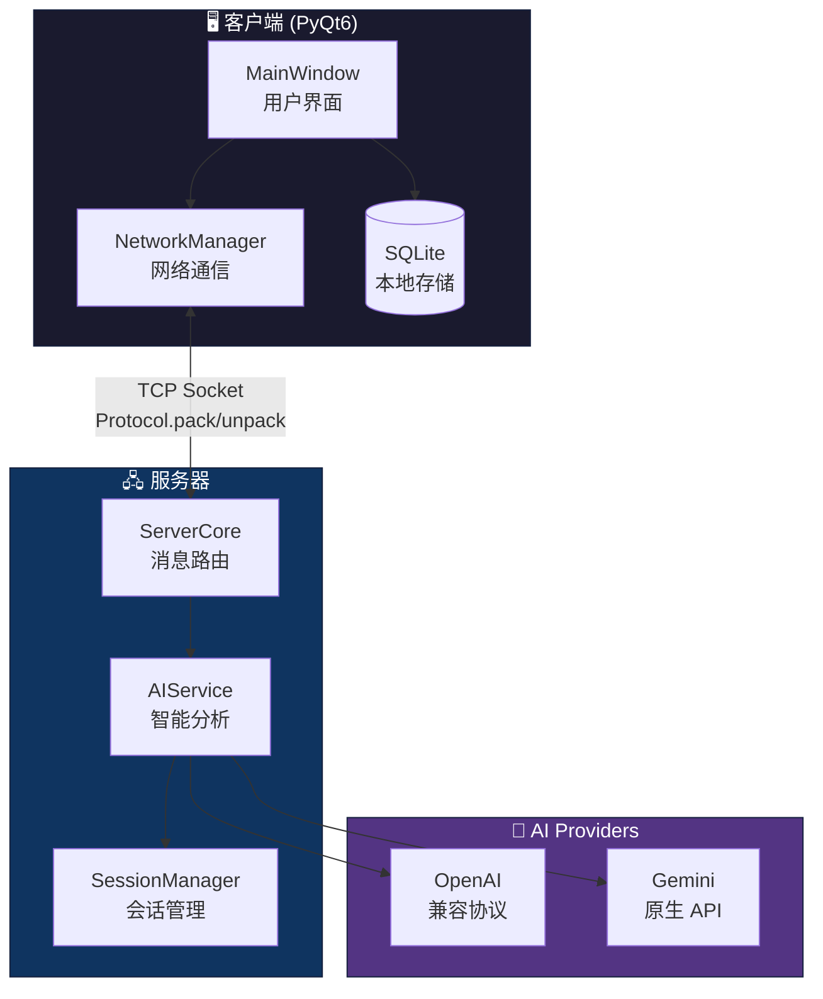

# 🐾 PetChat

<p align="center">
  
  
  
  
</p>

<p align="center">
  <b>一款智能桌面聊天应用 —— 拥有情绪感知宠物与 AI 记忆提炼功能</b>
</p>

---

## ✨ 核心特性

| 功能 | 描述 |
|------|------|
| 🌐 **实时通信** | Client-Server 架构，多用户同时在线，公共群聊 + 私人对话 |
| 🐱 **情绪宠物** | AI 分析对话氛围，宠物表情随情绪动态变化 |
| 🧠 **智能记忆** | 自动提炼对话中的共同事件、约定和话题 |
| 💡 **AI 建议** | 意图识别，智能生成行程和决策建议 |

---

## 🏗️ 系统架构



---

## 🚀 快速开始

### 1️⃣ 环境准备

```bash
# 克隆仓库
git clone https://github.com/XenithMC/petchat.git
cd petchat

# Windows
setup_venv.bat

# Linux/macOS
source setup_venv.sh

# 或手动安装
pip install -r requirements.txt
```

### 2️⃣ 启动服务器

```bash
python server.py
```

服务器将在 `0.0.0.0:8888` 启动监听。

### 3️⃣ 启动客户端

```bash
python main.py

# 或直接指定服务器 IP
python main.py --server-ip 192.168.1.100
```

### 4️⃣ 配置 AI（可选）

通过菜单 `设置 → AI 配置` 或 `Ctrl+K` 配置 API Key。

支持的 AI Provider：
- **OpenAI 兼容协议**（LM Studio、Ollama、OpenAI API 等）
- **Google Gemini**

---

## 📁 项目结构

```
petchat/
├── server.py            # 聊天服务器入口
├── main.py              # 客户端应用入口
├── core/
│   ├── network.py       # TCP 网络通信
│   ├── protocol.py      # 消息协议 (Header + JSON)
│   ├── ai_service.py    # AI 服务封装
│   ├── database.py      # SQLite 数据库
│   └── providers/       # AI Provider 实现
│       ├── openai_provider.py
│       ├── gemini_provider.py
│       └── factory.py   # Provider 工厂
├── ui/
│   ├── main_window.py   # 主窗口
│   ├── pet_widget.py    # 情绪宠物组件
│   └── theme.py         # 暗黑主题
└── tests/               # 测试套件
```

---

## 🔧 协议格式

```
┌────────────────────────────────────────┐
│  Header (8 bytes)  │     Payload       │
├────────────────────┼───────────────────┤
│ Length (4B) │ CRC32 (4B) │   JSON      │
└────────────────────────────────────────┘
```

- **Header**: 固定 8 字节，包含载荷长度和 CRC32 校验
- **Payload**: UTF-8 编码的 JSON 数据

---

## 🧪 测试

```bash
# 运行 AI Provider 测试
python -m pytest tests/test_ai_providers.py -v

# 网络通信测试
python tests/network_test.py

# 压力测试
python tests/stress_test.py
```

---

## 📦 打包分发

```bash
# 客户端打包
python -m PyInstaller --name=pet-chat --onefile --windowed main.py

# 服务器打包
python -m PyInstaller --name=pet-chat-server --onefile server.py
```

生成的可执行文件位于 `dist/` 目录。

---

## 🔒 隐私与安全

- **数据本地化**：对话内容与记忆仅存储于本地 `petchat.db`
- **透明 AI 请求**：AI 仅在分析间隔发送必要的匿名上下文

---

## 📄 开源协议

本项目采用 **GNU GPLv3** 协议。

```
This program is free software: you can redistribute it and/or modify
it under the terms of the GNU General Public License as published by
the Free Software Foundation, either version 3 of the License, or
(at your option) any later version.
```

---

## 🤝 贡献

欢迎提交 Issue 和 Pull Request！

1. Fork 本仓库
2. 创建特性分支 (`git checkout -b feature/amazing-feature`)
3. 提交更改 (`git commit -m 'Add amazing feature'`)
4. 推送到分支 (`git push origin feature/amazing-feature`)
5. 创建 Pull Request