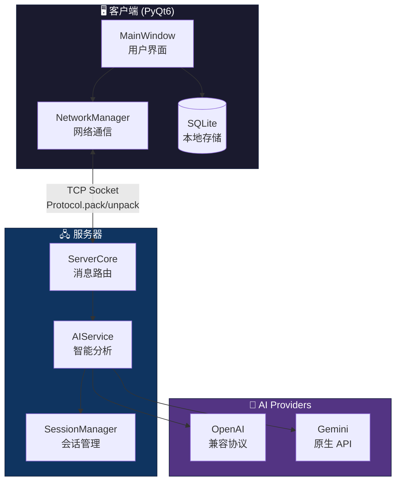

# 🐾 PetChat

<p align="center">
  
  
  
  
</p>

<p align="center">
  <b>一款智能桌面聊天应用 —— 拥有情绪感知宠物与 AI 记忆提炼功能</b>
</p>

<p align="center">
  <a href="#-核心特性">核心特性</a> •
  <a href="#-快速开始">快速开始</a> •
  <a href="#-系统架构">系统架构</a> •
  <a href="#-项目结构">项目结构</a> •
  <a href="#-贡献">贡献</a>
</p>

---

## ✨ 核心特性

| 功能 | 描述 |
|------|------|
| 🌐 **实时通信** | Client-Server 架构，多用户同时在线，公共群聊 + 私人对话 |
| 🐱 **情绪宠物** | AI 分析对话氛围，宠物表情随情绪动态变化 |
| 🧠 **智能记忆** | 自动提炼对话中的共同事件、约定和话题 |
| 💡 **AI 建议** | 意图识别，智能生成行程和决策建议 |
| 🔒 **隐私优先** | 数据本地存储，AI 请求透明可控 |
| 🎨 **暗黑主题** | 现代化 UI 设计，支持主题定制 |

---

## 🚀 快速开始

### 1️⃣ 环境准备

**系统要求：**
- Python 3.10+
- Windows 10/11, Linux, macOS

```bash
# 克隆仓库
git clone https://github.com/XenithMC/petchat.git
cd petchat

# Windows
setup_venv.bat

# Linux/macOS
source setup_venv.sh

# 或手动安装依赖
pip install -r requirements.txt
```

### 2️⃣ 启动服务器

```bash
python server_cli.py
```

服务器默认在 `0.0.0.0:8888` 启动监听。

**可选参数：**
```bash
# 指定端口
python server_cli.py --port 9000

# 指定日志级别
python server_cli.py --log-level DEBUG
```

### 3️⃣ 启动客户端

```bash
python main.py

# 或指定服务器 IP
python main.py --server-ip 192.168.1.100
```

### 4️⃣ 配置 AI（可选）

通过菜单 `设置 → AI 配置` 或快捷键 `Ctrl+K` 配置 API Key。

**支持的 AI Provider：**
- **OpenAI 兼容协议**（LM Studio、Ollama、OpenAI API 等）
- **Google Gemini**

---

## 🏗️ 系统架构


```mermaid
graph TB
    subgraph Client["🖥️ 客户端 (PyQt6)"]
        UI["MainWindow<br/>用户界面"]
        NM["NetworkManager<br/>网络通信"]
        DB_C[("SQLite<br/>本地存储")]
    end
    
    subgraph Server["🖧 服务器"]
        SC["ServerCore<br/>消息路由"]
        AI["AIService<br/>智能分析"]
        SM["SessionManager<br/>会话管理"]
    end
    
    subgraph Providers["🤖 AI Providers"]
        OP["OpenAI<br/>兼容协议"]
        GP["Gemini<br/>原生 API"]
    end
    
    UI --> NM
    NM <-->|"TCP Socket<br/>Protocol.pack/unpack"| SC
    SC --> AI
    AI --> SM
    AI --> OP
    AI --> GP
    UI --> DB_C
    
    style Client fill:#1a1a2e,stroke:#16213e,color:#fff
    style Server fill:#0f3460,stroke:#16213e,color:#fff
    style Providers fill:#533483,stroke:#16213e,color:#fff
```

### 通信协议

```
┌────────────────────────────────────────┐
│  Header (8 bytes)  │     Payload       │
├────────────────────┼───────────────────┤
│ Length (4B) │ CRC32 (4B) │   JSON      │
└────────────────────────────────────────┘
```

- **Header**: 固定 8 字节，包含载荷长度和 CRC32 校验
- **Payload**: UTF-8 编码的 JSON 数据

---

## 📁 项目结构

```
petchat/
├── server_cli.py          # 聊天服务器入口
├── main.py                # 客户端应用入口
├── setup_venv.bat         # Windows 虚拟环境脚本
├── setup_venv.sh          # Linux/macOS 虚拟环境脚本
├── requirements.txt       # Python 依赖
├── core/
│   ├── network.py         # TCP 网络通信
│   ├── protocol.py        # 消息协议 (Header + JSON)
│   ├── ai_service.py      # AI 服务封装
│   ├── ai_session_manager.py  # AI 会话管理
│   ├── database.py        # SQLite 数据库
│   ├── models.py          # 数据模型
│   ├── config_manager.py  # 配置管理
│   ├── server_core.py     # 服务器核心逻辑
│   ├── window_manager.py  # 窗口管理
│   ├── crash_reporter.py  # 崩溃报告
│   └── providers/         # AI Provider 实现
│       ├── base.py        # Provider 基类
│       ├── openai_provider.py
│       ├── gemini_provider.py
│       ├── retry.py       # 重试机制
│       └── factory.py     # Provider 工厂
├── ui/
│   ├── main_window.py     # 主窗口
│   ├── server_window.py   # 服务器窗口
│   ├── pet_widget.py      # 情绪宠物组件
│   ├── memory_viewer.py   # 记忆查看器
│   ├── suggestion_panel.py # 建议面板
│   ├── api_config_dialog.py # API 配置对话框
│   ├── user_profile_dialog.py # 用户配置
│   └── theme.py           # 暗黑主题
├── config/
│   └── settings.py        # 应用配置
├── tests/                 # 测试套件
│   ├── network_test.py
│   ├── test_ai_providers.py
│   ├── stress_test.py
│   └── verify_cs_server.py
└── .github/
    └── workflows/         # CI/CD 配置
```

---

## 🧪 测试

```bash
# 运行 AI Provider 测试
python -m pytest tests/test_ai_providers.py -v

# 网络通信测试
python tests/network_test.py

# 多进程启动测试
python tests/launch_multiprocess.py

# 压力测试
python tests/stress_test.py
```

---

## 📦 打包分发

```bash
# 客户端打包
python -m PyInstaller --name=pet-chat --onefile --windowed main.py

# 服务器打包
python -m PyInstaller --name=pet-chat-server --onefile server_cli.py
```

生成的可执行文件位于 `dist/` 目录。

---

## 🔒 隐私与安全

- **数据本地化**：对话内容与记忆仅存储于本地 `petchat.db`
- **透明 AI 请求**：AI 仅在分析间隔发送必要的匿名上下文
- **可配置 Provider**：支持本地 AI 服务（如 Ollama），数据不出内网

---

## 📄 开源协议

本项目采用 **GNU GPLv3** 协议。

```
This program is free software: you can redistribute it and/or modify
it under the terms of the GNU General Public License as published by
the Free Software Foundation, either version 3 of the License, or
(at your option) any later version.
```

---

## 🤝 贡献

欢迎提交 Issue 和 Pull Request！

### 贡献流程

1. Fork 本仓库
2. 创建特性分支 (`git checkout -b feature/amazing-feature`)
3. 提交更改 (`git commit -m 'Add amazing feature'`)
4. 推送到分支 (`git push origin feature/amazing-feature`)
5. 创建 Pull Request

### 开发指南

- 阅读 [`BUILD.md`](BUILD.md) 了解构建细节
- 阅读 [`SKILL.md`](SKILL.md) 了解项目规范
- 查看 [`CHANGELOG.md`](CHANGELOG.md) 了解版本历史

---

## 📬 联系方式

- **作者**: [Xustalis](https://github.com/Xustalis)
- **仓库**: [https://github.com/Xustalis/petchat](https://github.com/Xustalis/petchat)

---

